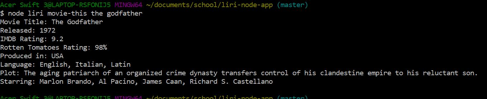
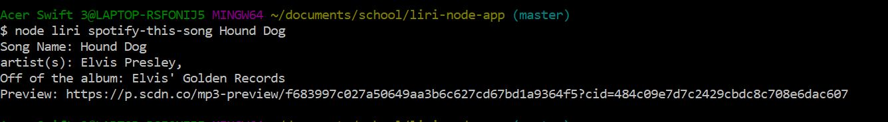
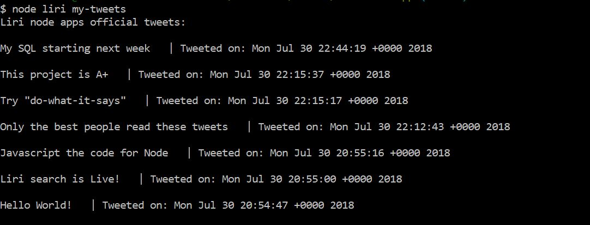
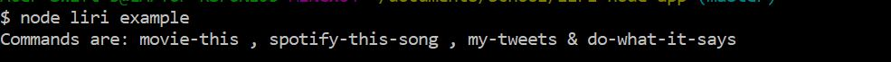

# liri-node-app

This project is a node based program that is a Language Interpretation and Recognition Interface pulling queries from Twitter, Spotify and the OMDB APIs.

## Instructions

From the command line you will run: "node liri " & a command

The commmands are:

###### movie-this

*node liri movie-this* will use the OMDB node package to search for information about a given movie and produce the Title, release date, plot, etc. from the database. 
For example *node liri movie-this The Godfather* produces:

###### spotify-this-song

*node liri spotify-this-song* will use the spotify API to search for information about a given song. Providing the Artist, Album and a preview of the song in mp3 form
For example *node liri spotify-this-song Hound Dog* produces:

###### my-tweets

*node liri my-tweets* uses the Twitter API to pull the most recent tweets from the associated twitter account. in this case it is @lirinodeproject twitter account.
For example: 

###### do-what-it-says
*node liri do-what-it-says* uses the built in .FS node library and will execute a command based on the random.txt file in this repository. 
For example in this case it searched spotify for the song "I want it that way":
 

###### Incorrect commands
If an incorrect command is entered LIRI will instruct on the correct commands to use:

